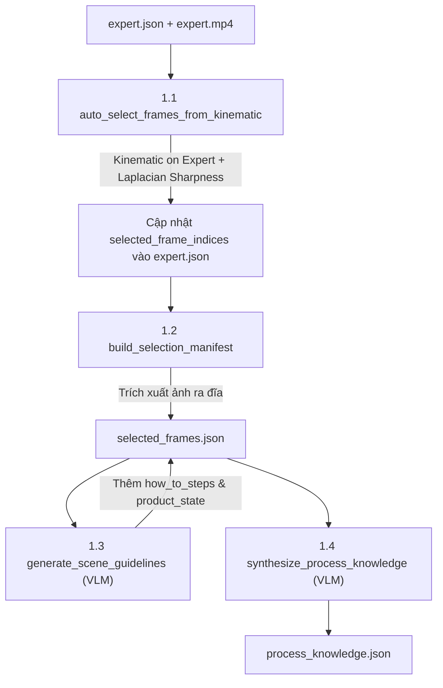
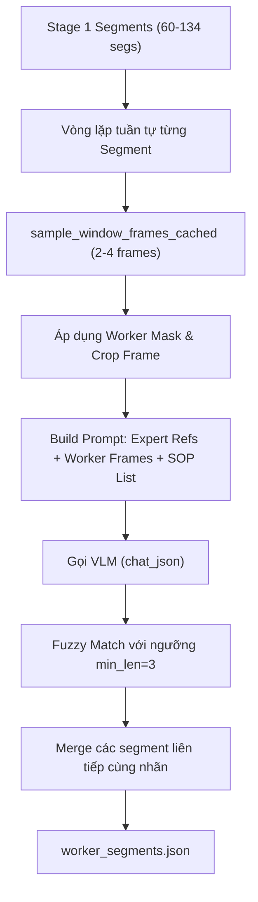
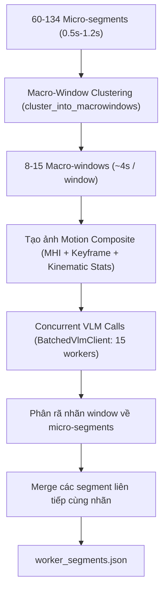

# Chi Tiết Logic Bước 1 và Bước 2 trong Stage 2 (Phase 2: Analysis)

Tài liệu này mô tả chi tiết kiến trúc, thuật toán, luồng xử lý dữ liệu và cấu trúc đầu vào/đầu ra của **Bước 1 (Expert Analysis)** và **Bước 2 (Worker Segment Classification)** thuộc **Stage 2 (Phase 2)** trong pipeline đánh giá kỹ năng may công nghiệp.

> Phiên bản này ghi nhận các thay đổi sau các lần cải hiện (Sep 2026):
> - Motion stats từ `decomposed_motion.npz` (thực từ optical flow) thay vì placeholder confidence
> - Fuzzy match với ngưỡng độ dài tối thiểu (3 ký tự) chống substring ngắn gây nhầm
> - Flag `vlm_uncertain` khi VLM trả UNKNOWN trên window có motion tín hiệu yếu

---

## TỔNG QUAN VỊ TRÍ TRONG HỆ THỐNG

Pipeline hoàn chỉnh gồm 2 giai đoạn:
- **Stage 1 (Kinematic Segmentation):** Dùng SAM3 + SEA-RAFT quang thông (optical flow), phân ranh giới chuyển động vật lý thuần túy (không dùng VLM, không cần video chuyên gia) → sinh ra `action_segments.json` + `decomposed_motion.npz`.
- **Stage 2 (VLM Analysis & Evaluation):** Dựa vào video chuyên gia (`expert.mp4`) và tri thức quy trình chuẩn để phân loại, đánh giá chất lượng thao tác của công nhân. Gồm 4 bước:
  1. **Bước 1 — `expert` ([`src/analysis/expert_analysis.py`](file:///Users/admin/Documents/work/WE/poc-ai4training/ai4training-aicore-poc/src/analysis/expert_analysis.py)):** Học và chuẩn hóa tri thức từ video chuyên gia.
  2. **Bước 2 — `classify` ([`src/analysis/segment_classify.py`](file:///Users/admin/Documents/work/WE/poc-ai4training/ai4training-aicore-poc/src/analysis/segment_classify.py)):** Gán nhãn thao tác chuẩn (SOP) cho các vi-phân đoạn vật lý từ Stage 1.
  3. **Bước 3 — `macro` ([`src/analysis/macro_eval.py`](file:///Users/admin/Documents/work/WE/poc-ai4training/ai4training-aicore-poc/src/analysis/macro_eval.py)):** So sánh thời gian thực hiện vĩ mô (thuần code, 0 VLM).
  4. **Bước 4 — `micro` ([`src/analysis/micro_eval.py`](file:///Users/admin/Documents/work/WE/poc-ai4training/ai4training-aicore-poc/src/analysis/micro_eval.py)):** Chẩn đoán nguyên nhân vi mô đối với các thao tác bị chậm (chỉ gọi VLM cho phân đoạn `slow`).

---

## BƯỚC 1: HỌC VÀ TRÍCH XUẤT TRI THỨC CHUYÊN GIA (EXPERT ANALYSIS)

### 1. Mục tiêu
Học quy trình may chuẩn tự động từ video mẫu của thợ bậc cao (`expert.mp4`) kết hợp ranh giới cảnh do con người định nghĩa (`expert.json`), tạo ra bộ khung tham chiếu mà **không cần con người phải chọn từng frame mẫu thủ công**.

### 2. File mã nguồn & Cấu hình liên quan
- Module thực thi: [`src/analysis/expert_analysis.py`](file:///Users/admin/Documents/work/WE/poc-ai4training/ai4training-aicore-poc/src/analysis/expert_analysis.py)
- Cấu hình: [`src/config/phase2_expert.py`](file:///Users/admin/Documents/work/WE/poc-ai4training/ai4training-aicore-poc/src/config/phase2_expert.py)
- Prompts: [`src/prompts/expert_analysis_prompts.py`](file:///Users/admin/Documents/work/WE/poc-ai4training/ai4training-aicore-poc/src/prompts/expert_analysis_prompts.py)
- Đầu vào:
  - `expert.json`: Danh mục thao tác (`operations`), danh sách cảnh (`scenes`) gồm `scene_index`, `timestamp_start`, `timestamp_end`, `operations`.
  - `expert.mp4`: Video chuyên gia may mẫu.
  - Tùy chọn: `expert.mask.png` (mặt nạ ROI loại trừ các đối tượng gây nhiễu).
- Đầu ra:
  - `expert_scenes/frames/scene_XX/`: Các ảnh khung hình đại diện sắc nét nhất.
  - `expert_scenes/selected_frames.json`: Danh mục ảnh tham chiếu kèm tài liệu hướng dẫn từng bước (`guidelines`).
  - `expert_scenes/process_knowledge.json`: Tri thức tổng hợp toàn bộ quy trình.

---

### 3. Quy trình chi tiết 4 giai đoạn con trong Bước 1



#### 3.1. Tự động chọn Frame tham chiếu (`auto_select_frames_from_kinematic`)
Thay vì chọn frame thủ công hoặc lấy mẫu đều dễ dính ảnh mờ chuyển động (motion blur):
1. **Chạy Kinematic Segmentation trên `expert.mp4`:** Sử dụng bộ phân đoạn động học `KinematicSegmenter` (giống cơ chế Stage 1 của công nhân) để tìm ranh giới dừng/đổi hướng tay thực tế của chuyên gia.
2. **Gán Segment vào Scene:** Một cảnh (`scene`) của chuyên gia thường gồm nhiều vi-thao tác. Hệ thống tính điểm giữa (`midpoint`) của từng segment:
   $$\text{midpoint} = \frac{t_{\text{start}} + t_{\text{end}}}{2}$$
   Nếu $t_{\text{start}}^{\text{scene}} \le \text{midpoint} < t_{\text{end}}^{\text{scene}}$, segment đó được gán quyền sở hữu cho cảnh.
3. **Lấy mẫu ảnh sắc nét tối đa (`pick_sharpest_spread`):**
   - Với mỗi segment con, trích xuất các khung hình ứng viên với mật độ cao (nhân hệ số `SHARPNESS_POOL_FACTOR = 3`).
   - Chia thành các khoảng thời gian đều nhau, tại mỗi khoảng tính điểm độ nét qua phương sai toán tử Laplacian:
     $$\text{Score} = \text{Var}(\nabla^2 I) = \sum ( \Delta I - \mu )^2$$
   - Giữ lại khung hình có điểm Laplacian lớn nhất (ảnh nét nhất, không bị mờ do tay di chuyển nhanh).
   - Nếu một cảnh không có kinematic segment nào rơi vào (cảnh quá ngắn hoặc tĩnh), cơ chế fallback sẽ lấy mẫu đều trên toàn bộ thời lượng cảnh.
4. Ghi danh sách index khung hình đã chọn vào `expert.json` tại trường `scene["selected_frame_indices"]`.

#### 3.2. Xây dựng Manifest tuyển chọn (`build_selection_manifest`)
1. Đọc danh sách `selected_frame_indices` từ `expert.json`.
2. Trích xuất frame vật lý từ `expert.mp4` lưu vào thư mục `expert_scenes/frames/scene_{idx:02d}/frame_{index:06d}.jpg`.
3. Tự động phát hiện mặt nạ ROI cho chuyên gia (`expert.mask.png`).
4. Xuất file `selected_frames.json` chứa cấu trúc các cảnh, đường dẫn ảnh tham chiếu và nhãn thao tác tương ứng.

#### 3.3. Sinh Hướng Dẫn Thao Tác Từng Cảnh (`generate_scene_guidelines`)
Với mỗi cảnh trong `selected_frames.json`:
1. Gửi các frame tham chiếu của cảnh đến VLM (kèm mặt nạ ROI nếu có).
2. Sử dụng prompt `SYSTEM_LEARNING_PHASE` và `USER_LEARNING_PHASE` để yêu cầu VLM phân tích:
   - `operation_description`: Mô tả tổng quát hành động.
   - `how_to_steps`: Danh sách các bước nhỏ công nhân làm bằng tay và phụ liệu.
   - `product_state_before`, `product_state_during`, `product_state_after`: Tình trạng mép vải, đường may, nắp túi qua từng mốc.
   - `key_visual_cues`: Các dấu hiệu thị giác đặc trưng nhận diện thao tác.
3. Kết quả trả về dưới dạng JSON được lưu thẳng vào node `guideline` của từng cảnh trong `selected_frames.json` (hỗ trợ lưu cache để không gọi lại VLM khi chạy lại).

#### 3.4. Tổng Hợp Tri Thức Quy Trình (`synthesize_process_knowledge`)
1. Gom toàn bộ tóm tắt các cảnh (`scenes_summary`) và một số frame đại diện cho mỗi cảnh.
2. Gửi request đến VLM với prompt `SYSTEM_SYNTHESIS_PHASE` để chuẩn hóa toàn bộ quy trình:
   - Nhận diện các thao tác lặp lại (deduplication).
   - Định nghĩa điều kiện bắt đầu/kết thúc (`start_cues`, `end_cues`).
   - Lập danh sách các cặp thao tác dễ gây nhầm lẫn (`easily_confused_with`) và cách phân biệt.
3. Kết quả lưu tại `expert_scenes/process_knowledge.json`.

---

## BƯỚC 2: PHÂN LOẠI PHÂN ĐOẠN CÔNG NHÂN (SEGMENT CLASSIFICATION)

### 1. Mục tiêu
Nhận các ranh giới vi-thao tác vật lý (`action_segments.json`) từ Stage 1 của video công nhân (`worker.mp4`), đối chiếu với tri thức chuyên gia từ Bước 1 (`selected_frames.json`), xác định công nhân đang may bước nào trong quy trình SOP, đồng thời phát hiện kỹ thuật sai chuẩn (`off_standard`).

### 2. File mã nguồn & Cấu hình liên quan
- Module thực thi: [`src/analysis/segment_classify.py`](file:///Users/admin/Documents/work/WE/poc-ai4training/ai4training-aicore-poc/src/analysis/segment_classify.py)
- Cấu hình: [`src/config/phase2_classify.py`](file:///Users/admin/Documents/work/WE/poc-ai4training/ai4training-aicore-poc/src/config/phase2_classify.py)
- Prompts: [`src/prompts/kinematic_classify_prompts.py`](file:///Users/admin/Documents/work/WE/poc-ai4training/ai4training-aicore-poc/src/prompts/kinematic_classify_prompts.py)
- Motion viz: [`src/utils/motion_viz.py`](file:///Users/admin/Documents/work/WE/poc-ai4training/ai4training-aicore-poc/src/utils/motion_viz.py)
- Đầu vào:
  - `action_segments.json`: Các ranh giới vật lý từ Stage 1 (`start_time_s`, `end_time_s`, `duration_s`, `confidence`).
  - `decomposed_motion.npz`: Dữ liệu động học chi tiết từ Stage 1 (tốc độ, turbulence, likelihood theo frame).
  - `selected_frames.json`: Tri thức chuyên gia và ảnh tham chiếu từ Bước 1.
  - `worker.mp4`: Video công nhân may.
  - `worker.mask.png` / `expert.mask.png`: Mặt nạ ROI cho 2 video.
- Đầu ra:
  - `worker_segments/worker_segments.json`: Danh sách các phân đoạn đã gán nhãn thao tác.
  - `timeline_debug.json`: Tóm tắt timeline dạng text ngắn gọn để debug.
  - `cuts/*.mp4` (khi bật `--cut`): Video từng phân đoạn cắt rời.

---

### 3. Hai Chế Độ Phân Loại trong Code

Code hỗ trợ 2 bộ xử lý phân loại:
1. **Sequential Classifier ([`SegmentClassifier`](file:///Users/admin/Documents/work/WE/poc-ai4training/ai4training-aicore-poc/src/analysis/segment_classify.py#L621-L833)):** Chế độ cơ bản, duyệt tuần tự từng segment.
2. **Batched Classifier ([`BatchedSegmentClassifier`](file:///Users/admin/Documents/work/WE/poc-ai4training/ai4training-aicore-poc/src/analysis/segment_classify.py#L260-L618)):** Chế độ tối ưu, gom cụm cửa sổ vĩ mô + ảnh quỹ đạo động học MHI + gọi VLM đa luồng đồng thời.

---

### 4. Chi tiết Chế độ 1: Sequential SegmentClassifier



1. **Trích xuất khung hình (`sample_window_frames_cached`):**
   - Với mỗi vi-segment $[t_0, t_1]$, hệ thống lấy mẫu ảnh với FPS thích ứng:
     $$\text{sample\_fps} = \max\left(\text{MIN\_FPS}, \min\left(\text{MAX\_FPS}, \frac{6.0}{\max(\text{dur}, 0.5)}\right)\right)$$
   - Thường lấy từ 2–4 frames đại diện.
2. **Tiền xử lý & Che mặt nạ (Masking):**
   - Áp dụng mặt nạ ROI `worker.mask.png` (loại bỏ thợ phụ ngồi bên cạnh hoặc nền xưởng gây nhiễu).
   - Resize khung hình (mặc định width=1024) và encode Base64.
3. **Cấu trúc Prompt (`build_kinematic_classify_messages`):**
   - **System:** `SYSTEM_KINEMATIC_CLASSIFY` truyền vai trò chuyên gia đánh giá kỹ năng may, danh sách tổng quan các bước SOP.
   - **User:**
     - Danh sách thao tác ứng viên (`candidate_operations_text`) kèm hướng dẫn kỹ thuật (`how_to_steps`) và tình trạng sản phẩm (`product_state`).
     - Tùy chọn `UNKNOWN` (hành động ngoài quy trình hoặc bị che khuất) và `IDLE` (dừng tay/nghỉ).
     - Khung hình tham chiếu từ chuyên gia (`[Expert reference]`).
     - Khung hình của công nhân trong khoảng $[t_0, t_1]$ kèm timestamp.
4. **Phân tích kết quả VLM & Khớp nhãn Fuzzy (cải hiện):**
   - Trích xuất `operation_name` từ JSON phản hồi.
   - Chuẩn hóa chuỗi ký tự (loại bỏ dấu ngoặc, khoảng trắng thừa, đưa về lowercase):
     ```python
     def _norm_op(s: str, min_len: int = 3) -> str:
         """Normalize + drop strings shorter than min_len to avoid spurious substring matches."""
         normalized = re.sub(r'\s+', ' ', re.sub(r'[\(\)\[\]]', ' ', s)).strip().lower()
         return normalized if len(normalized) >= min_len else ""

     def _fuzzy_match(norm_raw: str, op_name: str) -> bool:
         """Match only when both strings >= 3 chars to prevent noise matches (e.g. "h" matching any op)."""
         if not norm_raw or not op_name:
             return False
         norm_op = _norm_op(op_name)
         return (
             norm_raw == norm_op
             or (len(norm_raw) >= 3 and norm_raw in norm_op)
             or (len(norm_op) >= 3 and norm_op in norm_raw)
         )
     ```
   - Nếu rơi vào `["IDLE", "UNKNOWN", "NONE"]` → gán nhãn `UNKNOWN`.
   - Lưu cờ `off_standard` (true/false) và lý do `off_standard_desc`.

---

### 5. Chi tiết Chế độ 2: BatchedSegmentClassifier (Kiến trúc Tối Ưu Hóa)

Chế độ này được thiết kế để giải quyết triệt để 4 rào cản khi Stage 1 sinh ra quá nhiều vi-phân đoạn (60–134 segments):



#### 5.1. Gom cụm Cửa sổ Vĩ mô (`cluster_into_macrowindows`)
- **Vấn đề giải quyết:** Stage 1 chia vi-thao tác vật lý (0.5s–1.2s), trong khi thao tác may tiêu chuẩn kéo dài 2s–6s. Nếu gọi từng đoạn nhỏ sẽ gây ra hiện tượng *Label Flickering* (nhãn chập chờn nhảy cóc) và làm chi phí API tăng vọt.
- **Nguyên lý gom cụm:**
  - Gom các micro-segment liên tiếp thành một `MacroWindow` với thời lượng tối đa `max_window_duration = 4.0s`.
  - **Tôn trọng ranh giới chuyển cảnh chuyên gia:** Khi mốc thời gian của segment bước sang phạm vi của một cảnh chuyên gia mới trong manifest, thuật toán chủ động ngắt cụm để tạo window mới, không để window lấn qua 2 bước SOP khác biệt.
  - Số lượng request VLM giảm từ **60 calls → 8–15 calls** (giảm 5–8 lần).
- **Motion stats từ `decomposed_motion.npz` (cải hiện):**
  - Trước: `avg_speed` = `avg_confidence` (placeholder vô nghĩa)
  - Sau: `_load_motion_stats_for_segments` đọc file `decomposed_motion.npz`:
    - Reconstruct time index từ `fps` + `np.arange(n) / fps`
    - Đọc `left_smooth_speeds`, `left_smooth_turbulences`, `overall_likelihood`
    - Tính `speed_median`, `speed_rms`, `turbulence`, `avg_likelihood` cho mỗi window
  - Format npz thực tế: các mảng `left_smooth_speeds`, `right_smooth_speeds`, `overall_likelihood` cùng length `n`, được index bằng frame number. Không có trường `times` hay `speeds` trực tiếp.

#### 5.2. Tạo ảnh Chuyển động Tích hợp MHI (`create_motion_composite`)
- **Vấn đề giải quyết:** VLM nhìn 2 ảnh tĩnh không biết tay công nhân đang đẩy vải, kéo vải hay dừng tay (Temporal Blindness).
- **Thuật toán MHI (Motion History Image):**
  - Tính sai khác chuyển động hoặc tích lũy vector dòng quang học qua các frame:
    $$H_{\tau}(x, y, t) = \begin{cases} \tau & \text{nếu } \Psi(x, y, t) = 1 \\ \max(0, H_{\tau}(x, y, t - 1) - 1) & \text{ngược lại} \end{cases}$$
  - Ánh xạ mức độ mới/cũ của chuyển động sang dải màu nhiệt (Colormap Jet): Màu nóng (đỏ/vàng) biểu diễn chuyển động gần nhất, màu lạnh (xanh dương) biểu diễn chuyển động trước đó.
  - Trộn ảnh MHI với khung hình chính và bổ sung số liệu động học từ Stage 1 (`decomposed_motion.npz`: `speed_median`, `turbulence`).
  - VLM nhìn vào 1 ảnh duy nhất có thể đọc được chính xác hướng di chuyển và hành vi của tay thợ.

#### 5.3. Gọi API Đa luồng Đồng thời (`BatchedVlmClient`)
- Thay vì gọi tuần tự `for` tốn 45–180 giây, hệ thống đẩy toàn bộ danh sách Macro-window vào hàng đợi của `BatchedVlmClient` với `max_workers = 15`.
- Sử dụng `concurrent.futures.ThreadPoolExecutor` để gửi song song các request đến OpenRouter.
- Thời gian xử lý giảm xuống chỉ còn **8–15 giây** cho toàn bộ video.

#### 5.4. Phân rã và Khớp nhãn ngược lại Micro-segments
- Sau khi VLM trả về kết quả cho `MacroWindow`, nhãn phân loại, lý do (`reasoning`), và cờ `off_standard` được phân bổ lại cho từng `KinematicSegment` thành phần nằm trong window đó.
- **Fuzzy match (cải hiện):** Dùng `_fuzzy_match()` với ngưỡng `min_len=3` để tránh substring ngắn gây false positive.
- **Flag `vlm_uncertain` (cải hiện):**
  - Nếu VLM trả `UNKNOWN` **VÀ** `avg_speed < VLM_UNCERTAIN_THRESHOLD (0.7)` → đánh dấu `vlm_uncertain = true`
  - Cho thấy cả tín hiệu động học lẫn VLM đều không tự tin → downstream `micro_eval` có thể quyết định gọi lại chi tiết hơn.
  - Ngưỡng `0.7` dựa trên giá trị `left_smooth_speeds` thực tế (thường 0.1–8.5 pixel/frame đối với thao tác may).

---

### 6. Logic Hậu Xử Lý Sau Phân Loại (Post-Processing)

Dù chạy ở chế độ tuần tự hay batched, cả 2 đều thực thi logic gom gộp sau cùng:

#### 6.1. Hợp nhất phân đoạn liên tiếp cùng nhãn (Consecutive Merge)
Nếu hai phân đoạn liền kề nhau được VLM gán cùng một `operation_name` (và khác `UNKNOWN`), chúng sẽ được gộp thành 1 phân đoạn lớn duy nhất:
```python
if (merged_segments and
    merged_segments[-1]["operation_name"] == s["operation_name"] and
    s["operation_name"] != "UNKNOWN"):
    prev = merged_segments[-1]
    prev["end_time"] = s["end_time"]
    prev["worker_duration_s"] = round(prev["end_time"] - prev["start_time"], 2)
    prev["n_vlm_calls"] += s["n_vlm_calls"]
    prev["worker_frame_count"] += s["worker_frame_count"]
    if s.get("off_standard"):
        prev["off_standard"] = True
        if s.get("off_standard_desc"):
            prev["off_standard_desc"] = (prev.get("off_standard_desc", "") + "; " + s["off_standard_desc"]).strip("; ")
else:
    merged_segments.append(s)
```
*Lưu ý:* Các đoạn mang nhãn `UNKNOWN` không bị gộp chung với nhau để tránh tạo thành các khoảng trống không rõ ràng kéo dài trên timeline.

#### 6.2. Xuất dữ liệu & Công cụ trực quan hóa
1. **Lưu `worker_segments.json`:** Lưu toàn bộ thông tin gồm: thời lượng, nhãn thao tác, số lượng VLM call, tổng chi phí API USD (`total_cost_usd`), bằng chứng vi mô (`action_evidence`, `product_state_evidence`).
2. **Debug Timeline (`--visualize`):**
   - Sinh file text [`timeline_debug.json`](file:///Users/admin/Documents/work/WE/poc-ai4training/ai4training-aicore-poc/data/1/worker_segments/timeline_debug.json) tóm tắt các đoạn:
     ```text
     00 [   0.0s -    2.4s] Lấy thân trước và nắp túi
     01 [   2.4s -    5.6s] Đặt nắp túi vào vị trí đánh dấu [OFF-STANDARD]
          -> Công nhân đặt lệch góc 2mm trước khi hạ chân vịt
     ```
   - Tự động gọi script [`tools/generate_timeline_html.py`](file:///Users/admin/Documents/work/WE/poc-ai4training/ai4training-aicore-poc/tools/generate_timeline_html.py) xuất báo cáo Web HTML tương tác.
   - Tự động gọi [`tools/render_classified_viz.py`](file:///Users/admin/Documents/work/WE/poc-ai4training/ai4training-aicore-poc/tools/render_classified_viz.py) render video demo overlay banner tên thao tác và màu cảnh báo off-standard.
3. **Cắt clip thực tế (`--cut`):** Cắt video gốc `worker.mp4` thành từng file clip `.mp4` riêng biệt trong thư mục `cuts/` phục vụ việc kiểm tra trực quan.

---

## BẢNG TỔNG HỢP CÁC FILE ĐẦU RA (SCHEMAS)

### 1. File `selected_frames.json` (Bước 1)
```json
{
  "task_name": "Diễu TP 4 cạnh nắp túi",
  "video_path": "data/1/cam-03_20260805_073527_cut_0_0-0_57.mp4",
  "mask_path": "data/1/cam-03_20260805_073527_cut_0_0-0_57.mask.png",
  "scenes": {
    "1": {
      "operations": [{"name": "Lấy bán thành phẩm"}],
      "timestamp_start": 0.0,
      "timestamp_end": 2.16,
      "frames": [
        "data/1/expert_scenes/frames/scene_01/frame_000012.jpg",
        "data/1/expert_scenes/frames/scene_01/frame_000035.jpg"
      ],
      "guideline": {
        "operation_name": "Lấy bán thành phẩm",
        "operation_description": "Tay trái với lấy thân trước, tay phải nhấc nắp túi đặt lên bàn may.",
        "how_to_steps": [
          "Tay trái đưa về phía giá chứa chi tiết bên trái",
          "Kẹp và nhấc chi tiết đặt ngay ngắn trước mặt bàn máy"
        ],
        "product_state_before": "Bán thành phẩm nằm rời trên giá",
        "product_state_during": "Chi tiết đang di chuyển trên không trung",
        "product_state_after": "Nắp túi đã đặt phẳng phiu trên mặt bàn máy",
        "key_visual_cues": ["Tay rời vô lăng máy may", "Chi tiết dịch chuyển từ giá vào bàn"]
      }
    }
  }
}
```

### 2. File `worker_segments.json` (Bước 2)
```json
{
  "task_name": "Diễu TP 4 cạnh nắp túi",
  "segments": [
    {
      "start_time": 0.0,
      "end_time": 2.36,
      "operation_name": "Lấy bán thành phẩm",
      "off_standard": false,
      "off_standard_desc": "",
      "evidence": "Công nhân cầm nắp túi từ khay đặt lên bàn máy",
      "action_evidence": "Hai tay di chuyển nhịp nhàng, không ngập ngừng",
      "product_state_evidence": "Nắp túi đã nằm ngay ngắn trước chân vịt",
      "vlm_uncertain": false,
      "n_vlm_calls": 1,
      "cost_usd": 0.00045,
      "worker_duration_s": 2.36,
      "worker_frame_count": 4,
      "motion_stats": {
        "speed_median": 8.5364,
        "speed_rms": 12.1821,
        "turbulence": 0.9735,
        "avg_likelihood": 0.62
      },
      "kinematic_data": {
        "segment_idx": 0,
        "boundary_type": "speed_valley",
        "confidence": 0.94,
        "window_idx": 0
      }
    }
  ],
  "raw_action_segments_count": 60,
  "total_cost_usd": 0.0125,
  "total_vlm_calls": 12,
  "classification_mode": "batched_macrowindow",
  "n_macrowindows": 8,
  "elapsed_s": 11.4
}
```

---

## LỊCH SỬ CẢI HIỆN (Sep 2026)

### Bug 1: Motion stats dùng placeholder thay vì dữ liệu thực

| | Trước | Sau |
|---|---|---|
| `avg_speed` | `avg(confidence)` — placeholder vô nghĩa | `median(left_smooth_speeds)` từ npz |
| `turbulence` | `0.0` cố định | `median(left_smooth_turbulences)` từ npz |
| Nguồn dữ liệu | Stage 1 segment confidence | `decomposed_motion.npz` optical flow |
| Hàm đọc | `_load_motion_stats` (sai format) | `_load_motion_stats_for_segments` + `_load_motion_stats` (đúng format) |

**Root cause:** `decomposed_motion.npz` không có key `times`/`speeds` — nó lưu `left_smooth_speeds` (shape `n`, fps để reconstruct index).

### Bug 2: Fuzzy match substring ngắn gây false positive

| | Trước | Sau |
|---|---|---|
| `_norm_op` | Không có guard độ dài | `min_len=3`: drop chuỗi ngắn hơn 3 ký tự |
| Match logic | `norm_raw in norm_op` (bất kể độ dài) | Chỉ khi `len(norm_raw) >= 3` |
| Wrapper | Không có | `_fuzzy_match(norm_raw, op_name)` rõ ràng |

**Lý do:** Input ngắn như `"h"`, `"to"` có thể là substring của bất kỳ operation name nào → false match.

### Bug 3: Không phát hiện uncertain results

| | Trước | Sau |
|---|---|---|
| UNKNOWN handling | Gán nhãn `UNKNOWN`, không có metadata | Thêm `vlm_uncertain: true` khi `avg_speed < 0.7 AND matched_op == "UNKNOWN"` |
| Threshold | Không có | `VLM_UNCERTAIN_THRESHOLD = 0.7` (từ thực nghiệm trên dữ liệu may) |
| Schema output | Không có trường `vlm_uncertain` | Thêm vào mỗi segment trong `worker_segments.json` |

**Ý nghĩa:** Flag này cho downstream `micro_eval` biết segment nào cần investigation thêm — cả kinematic lẫn VLM đều không tự tin.

### Bug 4: Format npz không match implementation

| | Trước | Sau |
|---|---|---|
| Expected keys | `times`, `speeds` | `left_smooth_speeds`, `fps` |
| Index method | Direct array lookup | `times[i] = i / fps` |
| Turbulence | `np.std(speeds[mask])` | `np.median(turb[mask])` (median robust hơn std với outliers) |

**Chi tiết format npz thực tế:**
```
left_smooth_speeds: float32[n_frames]
left_smooth_turbulences: float32[n_frames]
overall_likelihood: float32[n_frames]
fps: float64 (scalar)
→ times[i] = i / fps
```

---

## TÓM TẮT CÁC THAY ĐỔI QUAN TRỌNG

```
segment_classify.py — Thay đổi:
  + VLM_UNCERTAIN_THRESHOLD = 0.7        (constant mới)
  + _norm_op(s, min_len=3)              (guard độ dài)
  + _fuzzy_match(norm_raw, op_name)     (wrapper wrapper)
  + _load_motion_stats_for_segments()   (đọc npz đúng format)
  + vlm_uncertain trong mỗi segment     (schema mới)
  ~ _make_macrowindow() nhận motion_stats thực
  ~ cluster_into_macrowindows() nhận npz_path, truyền stats
  ~ BatchedSegmentClassifier.run() pass npz_path
  ~ BatchedSegmentClassifier._load_motion_stats() đúng format npz
  ~ SegmentClassifier._classify_segment() dùng _fuzzy_match()
  ~ BatchedSegmentClassifier._parse_window_result() dùng _fuzzy_match()
  ~ MacroWindow.avg_speed/turbulence = real motion stats (thay vì confidence)
```
